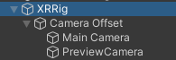
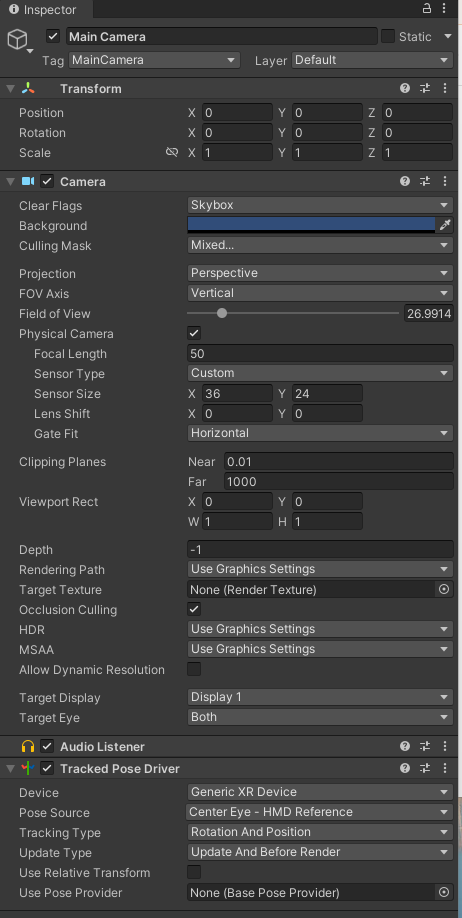
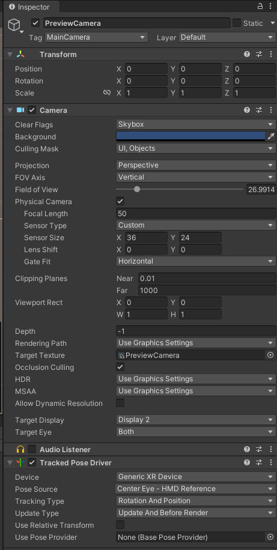
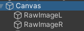
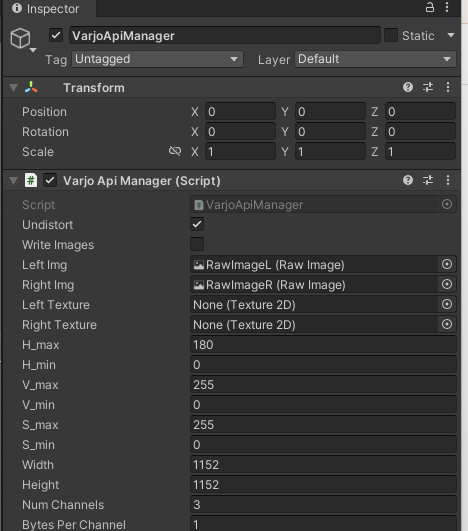
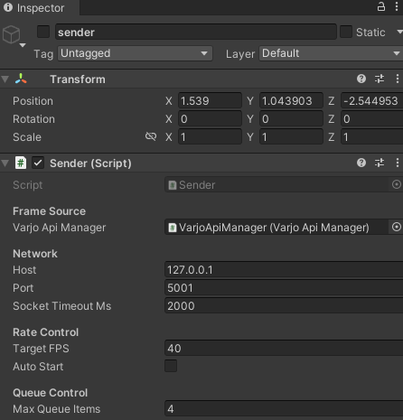
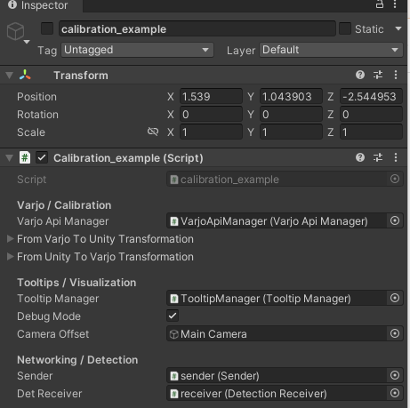
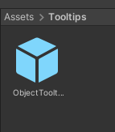
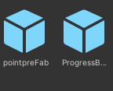
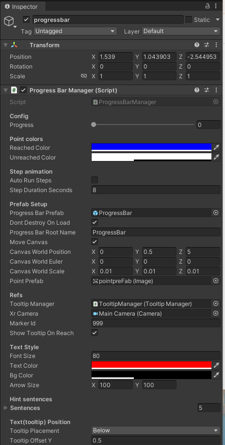

# Varjo Project- unity part
## necessary unity object
1. camera 



 


2. Directional Light


## calibration and object detection
1. Left and Right Camera Image

these two image are used for visualization. 



2. VarjoApiManager

        INTRODUCTION: It implements a Varjo API manager that acts as a centralized access point for all Varjo-related functionality in the project. It handles API initialization and shutdown, manages session state, and exposes higher-level helper functions for querying device status, configuration, and runtime information.

        1) Please create empty object.
        2) Drug VarjoApiManager.cs into inspector.
        3) Drug two camera image into Left Img and Right Img.



3. Sender 

        INTRODUCTION: it defines a sender component responsible for packaging and transmitting data to an external Python server.

        package:fixed 32-byte header followed by the raw image byte.
        ```
        int32 width (bytes 0–3)
        int32 height (bytes 4–7)
        int32 channels (bytes 8–11)
        int32 dtypeCode (bytes 12–15) 
        int32 payloadLength (bytes 16–19) — number of bytes in the image buffer
        int32 eyeId (bytes 20–23) — 0 = left, 1 = right
        int64 frameId

        byte[payloadLength] rawImage
        ```
        1) Please create empty object.
        2) Drug Sender.cs into inspector.
        3) Drag VarjoApiManager into frame source.

   

4. Receiver

        INTRODUCTION: It is a TCP listener that receives object-detection results from Python server and queues per-frame stereo bounding-box pairs (left + right) with a timestamp for later consumption.
        ```
        uint64 timestamp 
        int32 count 

        + repeat count times PairItem: 
        [ int32 clsid | 8×float32 (lx1,ly1,lx2,ly2, rx1,ry1,rx2,ry2) ]
        ```

        1) Please create empty object.
        2) Drug DetectionReceiver.cs into inspector.

5. Example

        INTRODUCTION: It is an example that do the calibration at the beginning , then detect objects in real time and show the 3d bboxes in varjo world. 



        1) Please create empty object.
        2) Drug calibration_example.cs into inspector.
        3) Drug Sender and Receiver into networking part.

        Please put varjo headset in front of calibration markers or aruco first. 

##  Text tooltip 
1. TooltipManager
        INTRODUCTION: It allows you to show and update tooltips(text tooltip) attached to game objects in the scene. Tooltips can be styled with custom text, size, font size, font color, and background color.
        1) Please create empty object.
        2) Drug TooltipManager.cs into inspector.
        3) Drug ObjectTooltipCanvas in Tooltips folder  into tooltop prefab. 
2. text_example 
        INTRODUCTION: Present Single Text tooltip in front of camera.
        1) Please create empty object.
        2) Drug Text_example.cs into inspector.

## ProgressBar
INTRODUCTION: it controls the progress bar at runtime by generating a segmented UI progress bar based on prefabs, animates the step-by-step traversal, updates the visual state, and displays optional XR tooltips. You can use the puublic api to trigger the progressbar from other files.
1) Please create empty object.
2) Drug ProgressBarManager.cs into inspector.
3) In Prefabs folder, there are two prefabs:

Please drag them into prefab setup.
4) please drag TooltipManager into refs. And XRcamera is main camera.




